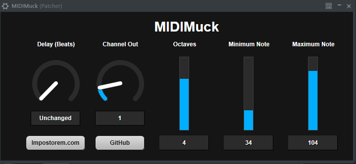

# Impostorem Tools

## Licensing
Copyright (c) 2020-2021 by Michael Ellison (<a href="https://www.impostorem.com">Impostorem</a>)

See <a href="LICENSE">LICENSE</a> file for full GPLv3 license details.

    This program is free software: you can redistribute it and/or modify
    it under the terms of the GNU General Public License as published by
    the Free Software Foundation, either version 3 of the License, or
    (at your option) any later version.

    This program is distributed in the hope that it will be useful,
    but WITHOUT ANY WARRANTY; without even the implied warranty of
    MERCHANTABILITY or FITNESS FOR A PARTICULAR PURPOSE.  See the
    GNU General Public License for more details.

    You should have received a copy of the GNU General Public License
    along with this program.  If not, see <https://www.gnu.org/licenses/>.

The Impostorem Tools include VST-compatible plugins and use the VST3 SDK under the GPLv3 license.   
VST is a registered trademark of Steinberg Media Technologies GmbH.

- VST3 SDK: https://github.com/steinbergmedia/vst3sdk

## About
Impostorem Tools are tools I use to play with music and video stuffs.
They currently include VST-compatible plugins for use with the Pianoshooter visualizer.
- <b>MIDIMuck</b>:  <a href="http://www.midi.org">MIDI</a> utility knife for transforming / delaying / filtering MIDI
- <b>BeatDelay</b>: Delays an audio stream by a number of beats (to synch it with video from Pianoshooter)

[Pianoshooter](https://github.com/devellison/pianoshooter) is a plugin for <a href="https://www.image-line.com/fl-studio-learning/fl-studio-online-manual/html/plugins/ZGameEditor%20Visualizer.htm">ZGameEditor Visualizer</a>
in <a href="https://www.image-line.com">FLStudio</a>. 
It is also included in the Impostorem Tools installers (along with [LyricText](https://github.com/devellison/lyrictext) )

An example of a project using LyricText, PianoShooter, MIDIMuck, and BeatDelay is [Euterpe](https://www.youtube.com/watch?v=WEeOEKrbE9A).

Currently the plugins are only tested on Win64 (although LyricText and Pianoshooter have worked on Mac).  
May port the plugins to Mac OSX when time allows (only a few points beyond project creation that need to be hit).

## MIDIMuck

MIDIMuck is a VST plugin that takes a MIDI / Event stream as input, transforms it,
then outputs the modified stream.  Its main purpose is to take a copy of the input 
MIDI used to play an instrument and tweak it to look nice in Pianoshooter.

Main features:
- <b>Octave shift</b> - make the notes appear in the octave you want in Pianoshooter
- <b>Delay</b> - in some cases, you may want to delay the MIDI to synch with audio.
  Usually though you'll want to use the BeatDelay plugin instead to delay the 
  raw audio itself.
- <b>Channel shift</b> - Allows you to tweak the channel for coloring effects.  If 0,
  the channel is left alone. Otherwise the input MIDI is output on the selected channel.
- <b>Min/Max Note</b> - You can set the minimum and maximum notes from a MIDI stream to
  pass through.  This is especially useful if you want to ignore key switches so
  they aren't displayed in PianoShooter.

Set MIDIMuck to be a generator, but chain it in patcher. 

For example, one channel's setup in [Euterpe](https://www.youtube.com/watch?v=WEeOEKrbE9A) looks like
the image below. One MIDI source is being tweaked and sent to three different channels in Kontakt as well
as being routed and tweaked separately to be sent back to FL Studio for ZGameEditor Visualizer and the PianoShooter.

## BeatDelay

BeatDelay delays the audio stream the set number of beats without adding additional effects.

This is useful when using Pianoshooter in the Player mode, where the MIDI is output
when the note should be created - you delay the sound until it actually hits the
piano key to provide a synchronized video to the audio.

Generally I put this in a pre-master mixing channel.

## Building
- Currently only tested with Microsoft Visual C++ 2017 Community. If you're using
  a different version, you'll want to change the cmake commands and upgrade the
  projects accordingly.

- First, get and build vst3sdk (I build it in an `./externals` directory)

      mkdir externals
      cd externals
      # I've had some issues with the recursive using SSH, so currently using https.
      # git clone --recursive git@github.com:steinbergmedia/vst3sdk.git
      git clone --recursive https://github.com/steinbergmedia/vst3sdk.git
      cd vst3sdk   

      git checkout v3.7.2_build_28
      git submodule update
   
      mkdir build
      cd build
      cmake.exe -G "Visual Studio 15 2017" -DSMTG_CREATE_BUNDLE_FOR_WINDOWS=OFF -DSMTG_ADD_VST3_PLUGINS_SAMPLE=OFF -DSMTG_ADD_VSTGUI=ON -DSMTG_CREATE_PLUGIN_LINK=OFF -DSMTG_USE_STATIC_CRT=ON -DCMAKE_BUILD_TYPE=Release -DCMAKE_INSTALL_PREFIX=.\vstsdk -A x64 ..
      cmake --build . --config Release

- Then build the impostorem_tools.sln solution. You can do this in the GUI if desired,
  but it works fine from the command-line.

      cd ..\..\..\win
      msbuild impostorem_tools.sln /t:Rebuild /p:Configuration=Release

-  You'll want to copy the .\bin\x64\Release\*.vst3 files to your VST3 folder, or make symbolic links.  I prefer the latter when doing development.
   You will likely need administrator rights and you'll need to tweak the paths for your environment:

       mkdir "C:\Program Files\Common Files\vst3\Impostorem"
       mklink "C:\Program Files\Common Files\vst3\Impostorem\BeatDelay.vst3" D:\github\impostorem_tools\bin\x64\Release\BeatDelay.vst3
       mklink "C:\Program Files\Common Files\vst3\Impostorem\MIDIMuck.vst3" D:\github\impostorem_tools\bin\x64\Release\MIDIMuck.vst3

## Creating Documentation

### Code
The code is documented Doxygen-style, and a Doxyfile is in the base directory.
By default it's set up to generate html.
To generate docs you'll need:
- Doxygen - https://www.doxygen.nl/download.html
- GraphViz - https://graphviz.org/download/

Then, you should be able to just run:

     Doxygen Doxyfile

Documentation will be placed in .\doc\html.

### Installer Readme
Converting the README.md to a PDF for the installer is a bit ugly right now.
I'm using grip to serve the file, the printing to PDF and placing the file at ./doc/pdf/readme.pdf.
This needs to be automated.

## Creating an Installer
Using NSIS 3.06.1 right now for Win64, which is available here: https://prdownloads.sourceforge.net/nsis/nsis-3.06.1-setup.exe?download
The installer includes Pianoshooter and LyricText (from separate repositories).

- First collect the additional externals for the installer into the ./externals directory.

      cd externals
      git clone git@github.com:devellison/pianoshooter.git
      git clone git@github.com:devellison/lyrictext.git
      # Checkout desired versions here if you don't want latest

- Create the documentation (see above documentation)
- Then run `makensis.exe` on the installer script to create the installer.

      cd ..\win
      "C:\Program Files (x86)\NSIS\bin\makensis.exe"  impostorem_tools.nsi

- The above outputs the executable installer in `..\bin`
